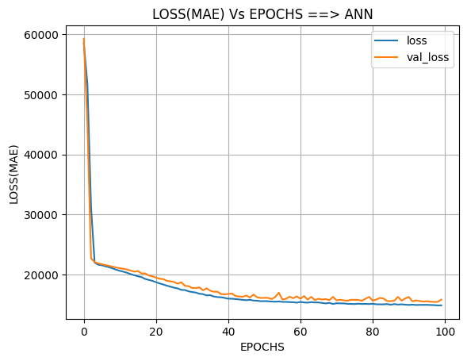
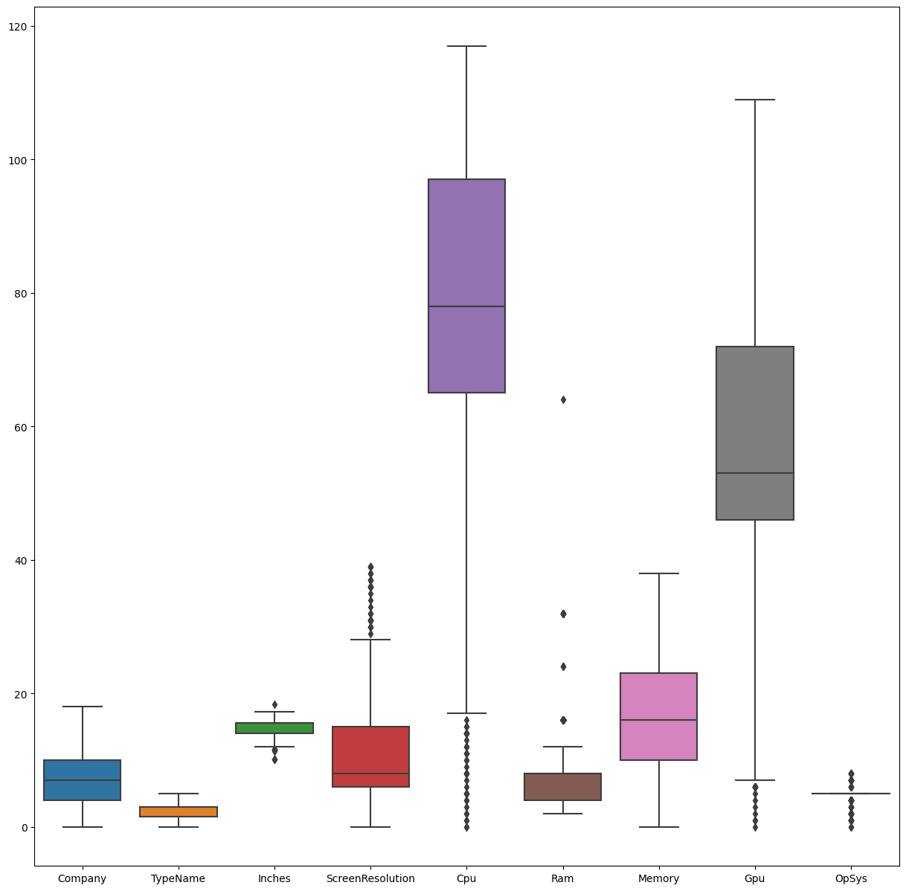

Here's a professional README file for the project "DL - Laptop Price Prediction" to post on GitHub:

---

# DL - Laptop Price Prediction

This project aims to predict laptop prices using various machine learning models, including deep learning neural networks.

## Table of Contents
1. [Main Library](#main-library)
2. [Reading Data](#reading-data)
3. [Feature Engineering](#feature-engineering)
4. [Data Preprocessing](#data-preprocessing)
5. [Data Visualization](#data-visualization)
6. [Splitting Data](#splitting-data)
7. [Building Neural Network](#building-neural-network)
8. [Evaluation](#evaluation)
9. [Results](#results)

## Main Library

### Importing Required Libraries
```python
import pandas as pd
import numpy as np
import matplotlib.pyplot as plt
import seaborn as sns
from sklearn.model_selection import train_test_split
from sklearn.preprocessing import LabelEncoder
from sklearn.metrics import r2_score
from sklearn.ensemble import RandomForestRegressor
import tensorflow as tf
import tensorflow.keras as k
```

## Reading Data

### Loading Data
```python
data = pd.read_csv(r"D:\Courses language programming\6_Deep Learning\Deep Learning Project\Folder\laptop_data.csv")
data.head(5)
data.isnull().sum()
data.info()
```

## Feature Engineering

### Creating New Features
```python
data["Company/typename"] = data["Company"] + " " + data["TypeName"]
data["Company/OpSys"] = data["Company"] + " " + data["OpSys"]
data.head(2)
```

## Data Preprocessing

### Processing Columns
```python
data["Ram"] = [data["Ram"].loc[i][:data["Ram"].loc[i].index("G")] for i in range(len(data["Ram"]))]
data["Ram"] = data["Ram"].astype(int)

data["Weight"] = [data["Weight"].loc[i][:data["Weight"].loc[i].index("k")] for i in range(len(data["Weight"]))]
data["Weight"] = data["Weight"].astype(float)
```

### Label Encoding
```python
La = LabelEncoder()
for col in data.select_dtypes(include="object").columns[:]:
    data[col] = La.fit_transform(data[col])
data.info()
```

## Data Visualization

### Correlation Heatmap
```python
plt.figure(figsize=(15, 15))
sns.heatmap(data.iloc[:, :9].corr(), annot=True, square=True, fmt="0.2f", vmax=1)
plt.show()
```

### Boxplot
```python
plt.figure(figsize=(15, 15))
sns.boxplot(data.iloc[:, :9])
plt.show()
```

## Splitting Data

### Splitting into Train and Test Sets
```python
X = data.drop(columns="Price", axis=1)
Y = data["Price"]

x_train, x_test, y_train, y_test = train_test_split(X, Y, train_size=0.7, random_state=42)
```

## Building Neural Network

### Neural Network Architecture
```python
model = k.models.Sequential([
    k.layers.Dense(128, activation="relu"),
    k.layers.Dense(64, activation="linear"),
    k.layers.Dense(32, activation="relu"),
    k.layers.Dense(16, activation="linear"),
    k.layers.Dense(1, activation="linear")
])

model.compile(optimizer=k.optimizers.RMSprop(0.001), loss='mae')
```

### Training the Model
```python
history = model.fit(x_train, y_train, epochs=100, validation_data=(x_test, y_test), validation_split=0.1)
```

### Loss Plot
```python
plt.plot(history.history["loss"], label="loss")
plt.plot(history.history["val_loss"], label="val_loss")
plt.title("LOSS(MAE) Vs EPOCHS ==> ANN")
plt.xlabel("EPOCHS")
plt.ylabel("LOSS(MAE)")
plt.legend()
plt.grid()
plt.show()
```

## Evaluation

### Model Evaluation
```python
model.evaluate(x_test, y_test)
print("The R2_score is ==> ", r2_score(model.predict(x_test), y_test))
```

## Results

- The final R2 score of the model is 0.525915546981758.
- Loss curves show the training and validation loss over epochs, indicating how well the model fits the data.

## Visualizations

- Loss Curve:

- Boxplot:

